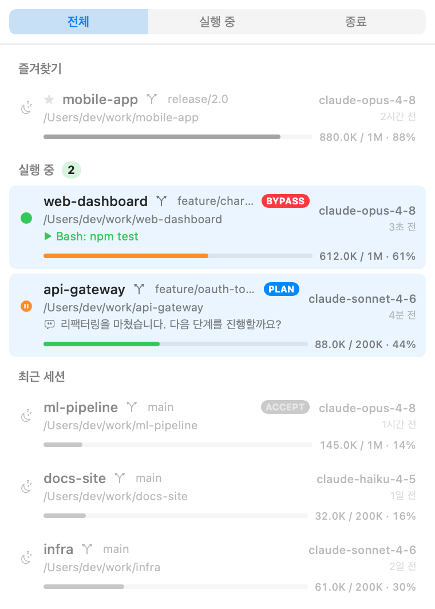
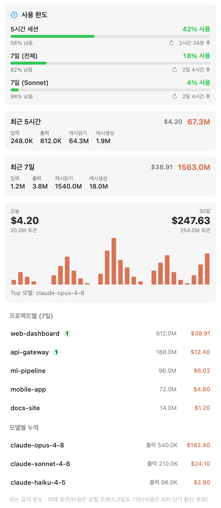
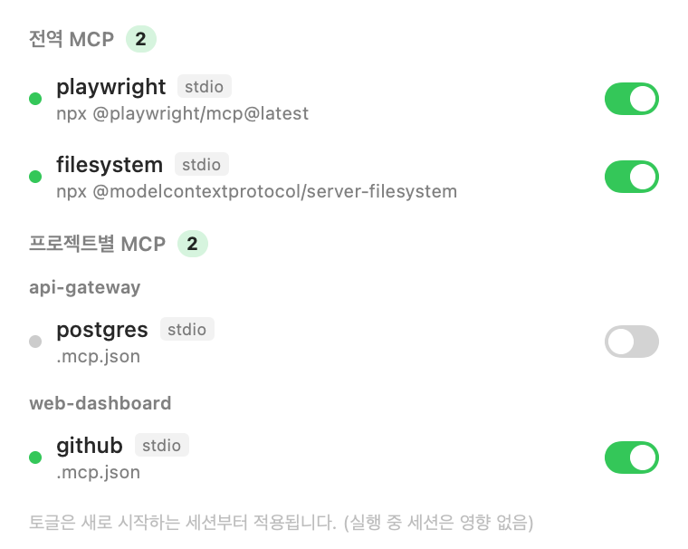
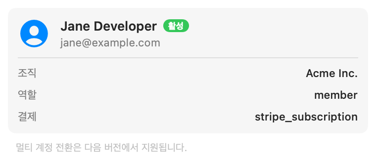

<div align="center">


# Claude Bar

**여러 Claude Code 세션을 한눈에 관리하는 macOS 메뉴바 앱**

[English](README.md) &nbsp;·&nbsp; 한국어

<p>
  
  
  
  
  
</p>

<p>
  <a href="https://github.com/bolero2/ClaudeBar/releases/latest"><b>⬇︎ 최신 ClaudeBar.app 다운로드</b></a>
</p>



</div>

---

여러 터미널에서 동시에 Claude Code를 돌릴 때, Claude Bar는 **어떤 세션이 진행 중인지 · 어디서 돌고 있는지 · 컨텍스트가 얼마나 찼는지**를 메뉴바에서 바로 보여줍니다. 클릭 한 번으로 해당 터미널로 점프하거나 종료된 세션을 복구합니다. 100% 네이티브 Swift, 외부 의존성 없음, **읽기 전용**으로 `~/.claude`만 들여다봅니다.

## ✨ 주요 기능

- 🖥️ **세션 관리** — 실행 중 / 대기 / 종료 상태, 작업 위치(cwd), git 브랜치, 사용 모델을 한 목록에서.
- 🔭 **실시간 활동** — 실행 중인 세션이 지금 뭐 하는지: 실행 중인 툴(`▶ Bash: npm test`) 또는 마지막 메시지.
- 🔑 **권한 모드** — 세션별 현재 모드를 한눈에: `PLAN` / `ACCEPT`(편집 수락) / `BYPASS`(`--dangerously-skip-permissions`).
- 🔍 **검색 · 필터 · 즐겨찾기** — 프로젝트 검색, 상태 필터(전체/실행 중/종료), 자주 쓰는 프로젝트 ★ 핀 고정.
- 📊 **세션별 컨텍스트 한도** — 각 세션의 컨텍스트 사용량을 표시. `200K` / `1M` 윈도우를 자동 추론(설정의 `[1m]` 모델 기록 + 관측된 최대 컨텍스트).
- ⚡ **클릭 → 점프 / 복구**
  - **실행 중** 세션 클릭 → 해당 **터미널 탭을 맨 앞으로**.
  - **종료된** 세션 클릭 → **새 터미널 창**에서 `cd` 후 `claude --resume`로 그 세션 복구.
- 🔔 **알림** — 세션이 **작업을 끝내고 입력을 기다릴 때**, 또는 세션 컨텍스트(80%)·사용 한도(90%) 임박 시 알림. 알림을 클릭하면 해당 세션으로 바로 점프.
- ⌨️ **전역 단축키** — `⌥⌘C`로 어디서든 패널 열기.
- ⌨️ **빠른 액션** — 디렉토리를 골라 **새 세션 시작**(원하면 `--dangerously-skip-permissions`로), 실행 중 세션 **종료(kill)**, 우클릭으로 "Finder에서 열기 / 경로 복사".
- 📈 **사용량**
  - **공식 사용 한도** — Claude Code `/usage`와 동일한 데이터: 5시간 세션, 7일(전체/Sonnet) **% 사용 + 리셋까지 남은 시간**.
  - **비용** — 오늘 / 7일 / 30일 추정 비용(토큰 × API 단가).
  - **프로젝트별 집계** — 프로젝트별 7일 비용 / 토큰 / 활성 세션, 비용순 정렬.
  - **로컬 토큰 집계** — 최근 5시간 / 7일 토큰 합계, **일별 히스토그램**(로컬 기준), 모델별 누적.
- 🧩 **MCP** — 전역 및 프로젝트별 MCP 서버 목록과 **on/off 토글**(`~/.claude.json`을 안전하게 수정).
- 👤 **계정** — 현재 연동된 Claude 계정(이메일·조직·역할).
- ⚙️ **설정** — **언어(English / 한국어)** 전환, 알림 토글, 경고 임계치 조절, 사용할 터미널 선택, 로그인 시 자동 실행.
- 🎛️ **다듬은 UX** — 최근 세션은 기본 회색, 마우스 오버 시 컬러. 라이브 세션 컨텍스트가 높으면 메뉴바 아이콘이 경고로 전환.
- 🔒 **로컬 전용** — 선택적 인증 사용량 조회 외에 네트워크 호출 없음. 그 외에는 `~/.claude` 파일만 읽습니다.

## 📸 스크린샷

<table>
  <tr>
    <td align="center"><b>세션</b></td>
    <td align="center"><b>사용량</b></td>
  </tr>
  <tr>
    <td></td>
    <td></td>
  </tr>
  <tr>
    <td align="center"><b>MCP</b></td>
    <td align="center"><b>계정</b></td>
  </tr>
  <tr>
    <td></td>
    <td></td>
  </tr>
</table>

> 스크린샷은 mock 데이터입니다.

## 🚀 설치 및 실행

> 요구 환경: **macOS 13+**

### 다운로드 (빌드 불필요) — 권장

1. [**최신 릴리즈**](https://github.com/bolero2/ClaudeBar/releases/latest)에서 `ClaudeBar.zip`을 받습니다.
2. 압축을 풀고 `ClaudeBar.app`을 `/Applications`로 옮깁니다.
3. ad-hoc 서명(노타라이즈 안 됨)이라 macOS가 격리하므로, 한 번만 격리 플래그를 제거합니다:

   ```bash
   xattr -dr com.apple.quarantine /Applications/ClaudeBar.app
   ```

   (또는 앱 우클릭 → **열기** → **열기**.) 이후 실행하면 메뉴바에 뜹니다.

### 소스에서 빌드

> **Swift 5.9+** 필요 (개발 환경: macOS 26 / Swift 6.3).

```bash
git clone https://github.com/bolero2/ClaudeBar.git
cd ClaudeBar
./scripts/make-app.sh      # release 빌드 + Info.plist + ad-hoc 서명 → ClaudeBar.app
open ClaudeBar.app         # 메뉴바에서 실행 (Dock 미표시)
```

`ClaudeBar.app`을 `/Applications`로 드래그하면 일반 앱처럼 설치됩니다.
로그인 시 자동 실행은 **시스템 설정 → 일반 → 로그인 항목**에 추가하세요.

> 🔑 **최초 실행 권한**
> - 터미널 점프는 **자동화(AppleScript)** 권한이 필요합니다(시스템 설정 → 개인정보 보호 및 보안 → 자동화 → ClaudeBar → Terminal).
> - 공식 사용량 조회는 Keychain의 OAuth 토큰을 읽으므로, **Keychain 접근 허용** 프롬프트가 한 번 뜰 수 있습니다 — 허용해 주세요.

### 개발용 직접 실행

```bash
swift build -c release
.build/release/ClaudeBar             # 메뉴바 실행
.build/release/ClaudeBar --probe     # UI 없이 데이터 자가 점검 (콘솔 출력)
```

## 🛠️ 동작 원리

MCP 토글(`~/.claude.json` 수정)과 인증 사용량 조회를 제외하면 **읽기 전용**입니다. `~/.claude` 아래 파일과 표준 시스템 도구만 사용합니다.

| 영역 | 데이터 소스 |
| --- | --- |
| 세션 목록 · 위치 · 모델 | `~/.claude/projects/<dir>/<sessionId>.jsonl` (폴더명 + JSONL tail) |
| 실행 상태 · 터미널 점프 | `ps` / `lsof`로 라이브 `claude` 프로세스 탐지 → tty 매칭 AppleScript |
| 세션별 컨텍스트 한도 | JSONL `usage`(input/cache/output) + `~/.claude.json`의 `[1m]` 모델 기록 |
| 로컬 사용량 (5h · 7d · 일별) | JSONL `usage` 레코드 시간창 집계 (바이트 파서 + mtime 캐시) |
| 공식 사용 한도 | `GET https://api.anthropic.com/api/oauth/usage` + Keychain OAuth 토큰 |
| MCP · 계정 | `~/.claude.json` (`mcpServers`, `projects[]`, `oauthAccount`) |

### 개인정보 / 보안

- 프로세스 환경변수에는 `CLAUDE_API_KEY` 등 비밀이 들어있어, 터미널 식별에 필요한 `TERM_PROGRAM` / `TERM_SESSION_ID`만 추출하고 나머지는 저장·로깅하지 않습니다.
- Keychain에서 읽은 OAuth 토큰은 사용량 요청의 `Authorization` 헤더에만 사용하며 로깅·저장하지 않습니다.
- `~/.claude.json` 수정(MCP 토글)은 **원자적**이며 롤링 백업(`~/.claude.json.claudebar-bak`)을 둡니다. 끈 전역 서버 설정은 사이드카 파일에 보관해 무손실 복원합니다.

> `/api/oauth/usage`는 **비공식 엔드포인트**라, Anthropic이 변경하면 로컬 토큰 집계로 폴백합니다.

## 🧱 아키텍처

```
Sources/ClaudeBar/
├─ App.swift            진입점(@main) · MenuBarExtra · Dock 숨김
├─ AppState.swift       관찰 가능한 상태 (세션 5s / 사용량 + 한도 60s)
├─ Diagnostics.swift    --probe 자가 점검 · --render 스크린샷
├─ MockData.swift       스크린샷용 가상 데이터
├─ Core/                ClaudePaths · Models · ConfigStore · Shell
├─ Services/            SessionScanner · ProcessProbe · TerminalActivator
│                       UsageService · OfficialUsageService · MCPService
└─ Features/            RootView + 탭별 View · Format
```

- **의존성 0** — SwiftUI / AppKit / Charts(모두 OS 기본 프레임워크)만 사용.
- **성능** — 30일치 트랜스크립트 집계를 바이트 레벨 파싱 + 파일 캐시로 약 0.3초에 처리.

## 🗺️ 로드맵

- [x] 공식 `/usage` 사용 한도(5h · 7d) + 리셋 시간
- [x] MCP on/off 토글
- [x] 알림 · 실시간 활동 · 비용 추적 · 빠른 액션
- [x] 설정 · 검색/필터/즐겨찾기 · 프로젝트별 집계
- [x] 현지화(English / 한국어) · 권한 모드 뱃지
- [x] 전역 단축키(⌥⌘C) · 알림 클릭 점프
- [x] OAuth 토큰 자동 refresh · 임계치 사용자 설정
- [ ] macOS 위젯 (Xcode 프로젝트 + App Groups용 Developer 서명 필요)
- [ ] 멀티 계정 전환

## 📄 라이선스

[MIT](LICENSE) © bolero2

<sub>Claude Bar는 Anthropic과 무관한 비공식 커뮤니티 프로젝트입니다.</sub>
