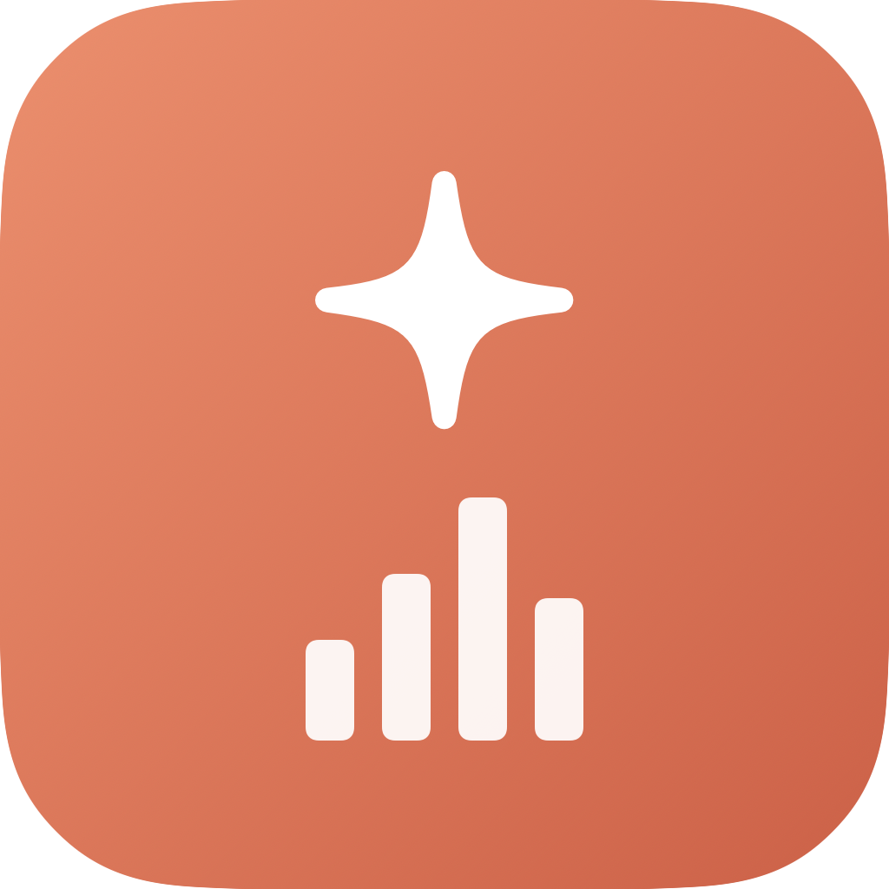
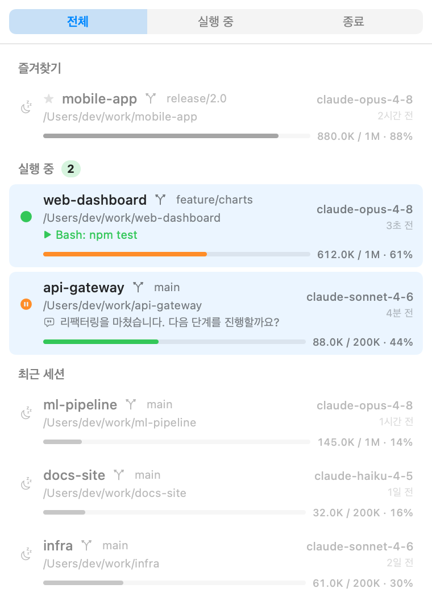
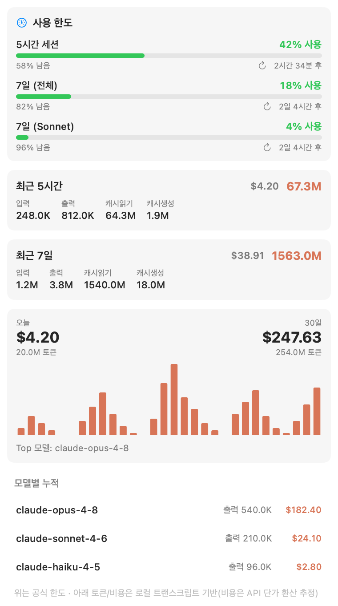
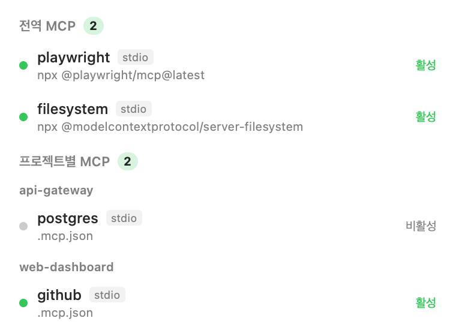
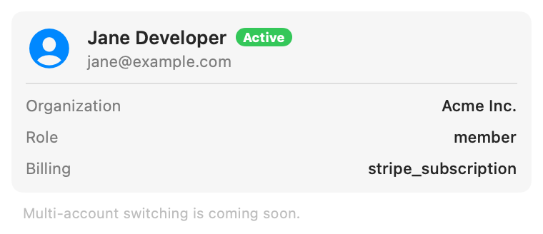

<div align="center">



# Claude Bar

**A native macOS menu bar app to manage multiple Claude Code sessions at a glance**

English &nbsp;·&nbsp; [한국어](README-kr.md)

<p>
  
  
  
  
  
</p>



</div>

---

When you run several Claude Code sessions across different terminals, Claude Bar shows — right from the menu bar — **which session is working, where it's running, and how full its context window is**. One click jumps to the owning terminal or resumes an ended session. It's 100% native Swift, has zero dependencies, and is **read-only**: it only looks at files under `~/.claude`.

## ✨ Features

- 🖥️ **Session management** — running / waiting / ended status, working directory (cwd), git branch and model, all in one list.
- 📊 **Per-session context window** — each session shows how much of its context window is used, with the `200K` / `1M` window auto-detected (from the project's `[1m]` model record + the largest observed context).
- ⚡ **Click to jump / resume**
  - Click a **running** session → bring its **terminal tab to the front**.
  - Click an **ended** session → open a **new terminal window**, `cd` into its directory and `claude --resume` that exact session.
- 📈 **Usage**
  - **Official rate limits** — the same data as Claude Code's `/usage`: 5-hour session, 7-day week (and Sonnet-only) **% used + time until reset**.
  - **Local token aggregation** — last 5h / 7d token totals, a **daily histogram** (local day), and per-model lifetime totals.
- 🧩 **MCP** — list global and per-project MCP servers and **toggle them on/off** (safely edits `~/.claude.json`).
- 👤 **Account** — the currently linked Claude account (email, organization, role).
- 🔔 **Context alert** — when a live session crosses 80% of its window, the menu bar icon turns into a warning.
- 🎛️ **Polished UX** — recent sessions are muted to grayscale until you hover them.
- 🔒 **Local-only** — no network calls except the optional, authenticated usage lookup. Everything else reads files under `~/.claude`.

## 📸 Screenshots

<table>
  <tr>
    <td align="center"><b>Sessions</b></td>
    <td align="center"><b>Usage</b></td>
  </tr>
  <tr>
    <td></td>
    <td></td>
  </tr>
  <tr>
    <td align="center"><b>MCP</b></td>
    <td align="center"><b>Account</b></td>
  </tr>
  <tr>
    <td></td>
    <td></td>
  </tr>
</table>

> Screenshots use mock data.

## 🚀 Install & Run

> Requirements: **macOS 13+** · **Swift 5.9+** (developed on macOS 26 / Swift 6.3)

### Build the `.app` bundle (recommended)

```bash
git clone https://github.com/bolero2/ClaudeBar.git
cd ClaudeBar
./scripts/make-app.sh      # release build + Info.plist + ad-hoc sign → ClaudeBar.app
open ClaudeBar.app         # runs in the menu bar (no Dock icon)
```

Drag `ClaudeBar.app` into `/Applications` to install it like any other app.
To launch at login, add it under **System Settings → General → Login Items**.

> 🔑 **First-run permissions**
> - Jumping to a terminal needs **Automation (AppleScript)** permission (System Settings → Privacy & Security → Automation → ClaudeBar → Terminal).
> - The official usage lookup reads the OAuth token from the Keychain and may show a one-time **Keychain access** prompt — allow it.

### Run directly (development)

```bash
swift build -c release
.build/release/ClaudeBar             # menu bar
.build/release/ClaudeBar --probe     # headless self-check (prints to console)
```

## 🛠️ How it works

Strictly **read-only**, except for MCP toggles (which edit `~/.claude.json`) and the authenticated usage lookup. It uses files under `~/.claude` plus standard system tools.

| Area | Source |
| --- | --- |
| Sessions · location · model | `~/.claude/projects/<dir>/<sessionId>.jsonl` (folder name + JSONL tail) |
| Run status · terminal jump | `ps` / `lsof` to find live `claude` processes → tty-matching AppleScript |
| Per-session context window | JSONL `usage` (input/cache/output) + the `[1m]` model record in `~/.claude.json` |
| Local usage (5h · 7d · daily) | JSONL `usage` records bucketed by time window (byte-level parser + mtime cache) |
| Official rate limits | `GET https://api.anthropic.com/api/oauth/usage` with the Keychain OAuth token |
| MCP · account | `~/.claude.json` (`mcpServers`, `projects[]`, `oauthAccount`) |

### Privacy & security

- Process environments contain secrets such as `CLAUDE_API_KEY`; Claude Bar extracts only `TERM_PROGRAM` / `TERM_SESSION_ID` for terminal identification and never stores or logs the rest.
- The OAuth access token (read from the macOS Keychain) is used only in the `Authorization` header of the usage request — never logged or persisted.
- `~/.claude.json` edits (MCP toggles) are **atomic** and keep a rolling backup (`~/.claude.json.claudebar-bak`). Disabled global servers are stashed in a sidecar file so their config is never lost.

> The `/api/oauth/usage` endpoint is **undocumented**; if Anthropic changes it the app falls back to the local token aggregation.

## 🧱 Architecture

```
Sources/ClaudeBar/
├─ App.swift            entry point (@main) · MenuBarExtra · hides Dock icon
├─ AppState.swift       observable state (sessions 5s / usage + rate-limit 60s)
├─ Diagnostics.swift    --probe self-check · --render screenshots
├─ MockData.swift       fictional data for screenshots
├─ Core/                ClaudePaths · Models · ConfigStore · Shell
├─ Services/            SessionScanner · ProcessProbe · TerminalActivator
│                       UsageService · OfficialUsageService · MCPService
└─ Features/            RootView + per-tab views · Format
```

- **Zero dependencies** — only SwiftUI / AppKit / Charts (all OS frameworks).
- **Fast** — 30 days of transcripts are aggregated in ~0.3s via a byte-level parser and a per-file cache.

## 🗺️ Roadmap

- [x] Official `/usage` rate limits (5h · 7d) with reset times
- [x] MCP on/off toggle
- [ ] OAuth token auto-refresh when expired
- [ ] Multi-account switching
- [ ] User-configurable context warning threshold

## 📄 License

[MIT](LICENSE) © bolero2

<sub>Claude Bar is an unofficial community project, not affiliated with Anthropic.</sub>
